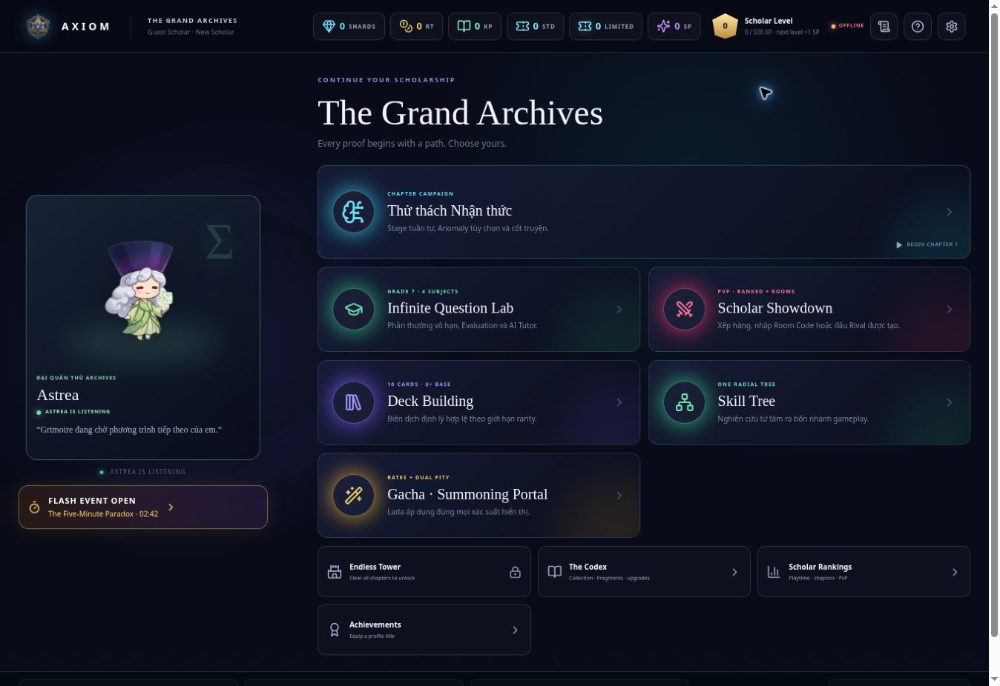
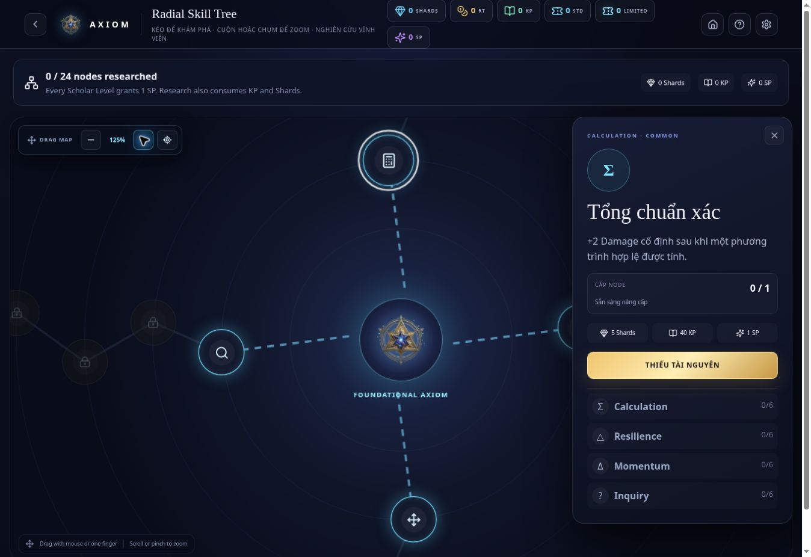
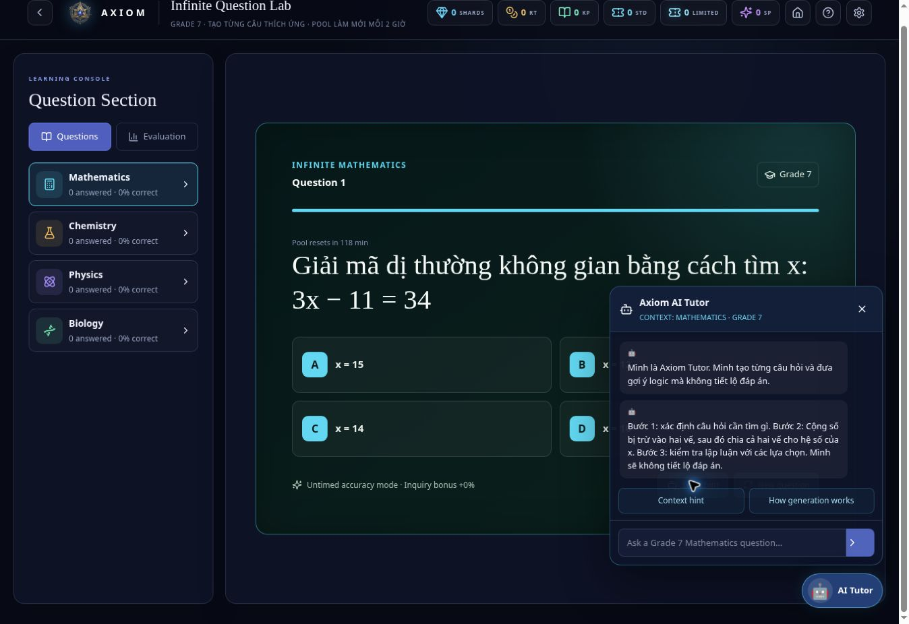
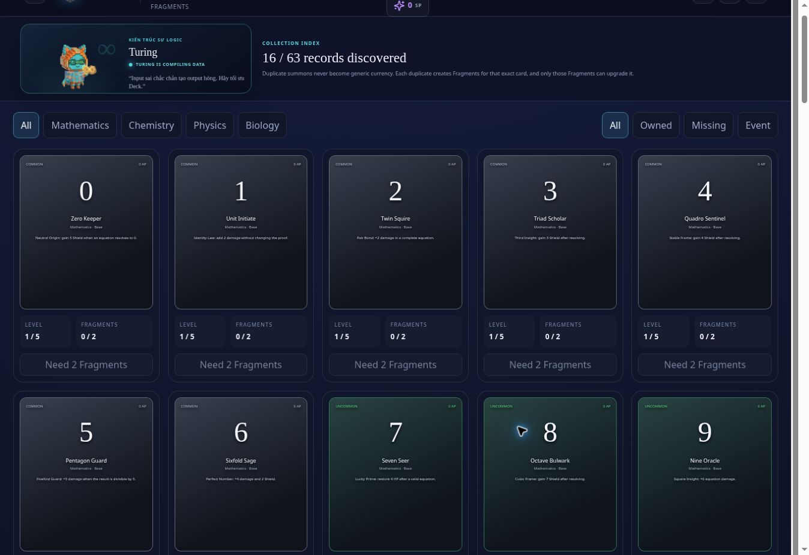
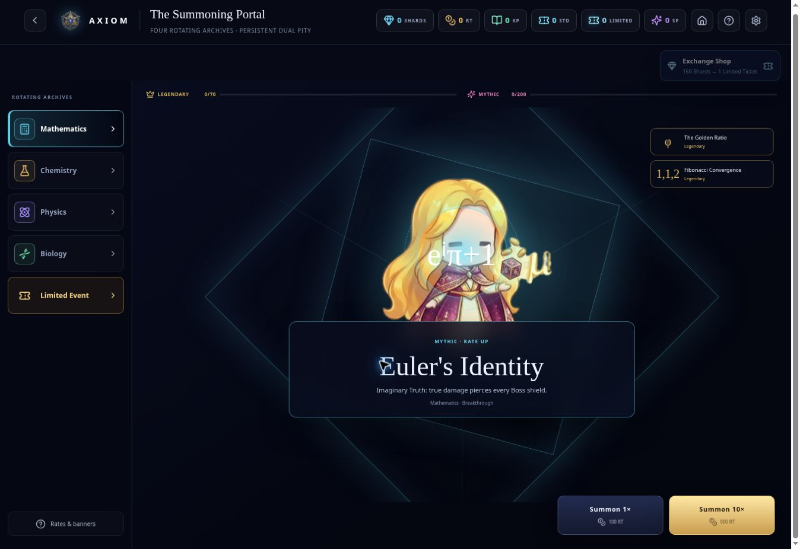

# Visual QA Evidence

Các ảnh trong thư mục này được chụp trực tiếp từ preview của codebase Axiomancy sau khi đi qua FTUE đến Grand Archives.

## Grand Archives



## Radial Skill Tree



## Infinite Question Lab và AI Tutor



## Codex / Card Bank



## Gacha subject banners



Các số đo DOM và kết quả build được ghi trong [TEST_RESULTS.md](TEST_RESULTS.md). Bảng đối chiếu tính năng–mã nguồn nằm tại [../../DEVELOPMENT_EVIDENCE.md](../../DEVELOPMENT_EVIDENCE.md).

File `axiomancy-history-through-v13.bundle` là Git bundle di động chứa lịch sử hoàn chỉnh đến commit Version 13. Kiểm tra bằng:

```bash
git bundle verify axiomancy-history-through-v13.bundle
```
